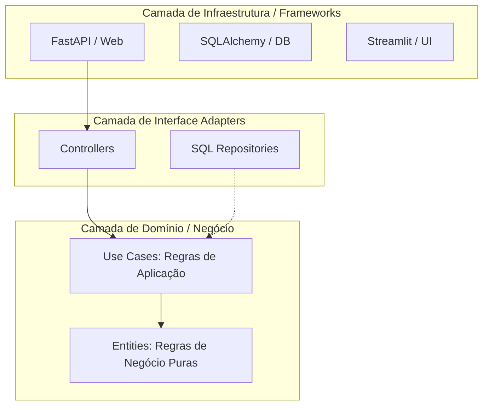

# Aula 01: O Coração da Clean Architecture e DTOs (Versão Expandida)

## 1. O Conceito: A Cebola e a Regra de Dependência

A **Clean Architecture** (Arquitetura Limpa) não é sobre pastas, é sobre **direção de dependência**.

### 1.1 Diagrama de Camadas e Fluxo

> **A Regra de Ouro:** O código das camadas internas **nunca** importa nada das camadas externas. Por exemplo: um arquivo dentro de `entities/` nunca pode dar um `import fastapi` ou `import sqlalchemy`.

---

## 2. O Mapa de Diretórios (O Onde Fica o Quê?)

Quando abrimos o projeto, a estrutura de pastas reflete as camadas da Clean Architecture. Usamos a abordagem de **Slices Verticais**, ou seja, organizamos primeiro pelo Domínio (ex: `users` ou `transactions`) e depois pelas camadas.

Dentro de um módulo (exemplo: `src/modules/users/`), você verá a seguinte estrutura:

### 2.1 `core/` (A Camada Interna Intocável)
O coração do domínio. Nada aqui dentro sabe que existe Internet, Banco de Dados ou Frameworks.
*   **`entities/`:** Os objetos do mundo real. Classes que representam regras absolutas. (Ex: `User`, `Password`). Elas validam a si mesmas e nunca existem em estado inválido.
*   **`exceptions.py`:** Os erros de negócio puros. Em vez de usar um erro genérico do Python, criamos erros como `UserAlreadyExistsException`.
*   **`interfaces/` (As Portas de Saída):** Contratos obrigatórios. O "Core" dita as regras do que ele precisa que o mundo externo faça, mas sem implementar como se faz. Exemplo: `IUserRepository`, que diz "Ei Mundo Externo, eu preciso de um método `save()`".
*   **`dtos/`:** (Data Transfer Objects) Estruturas de dados passivas (sem métodos/lógica) usadas apenas para enviar ou receber dados entre o *Core* e o mundo externo, evitando que a Entidade passeie desprotegida pela rede.

### 2.2 `use_cases/` (A Camada de Aplicação / Orquestrador)
Aqui ficam as regras específicas do *software*. Eles são os "Gerentes" do sistema.
*   Um `UseCase` (ex: `RegisterUser`) recebe um DTO, chama validações, pede para o repósitorio verificar se o email já existe, instancia a Entidade e manda outro repositório salvar as informações.
*   Apesar de orquestrar muito, ele continua não importando o "SQLAlchemy". Ele depende das `interfaces/` criadas pelo Core.

### 2.3 `adapters/` (A Camada Transformadora)
Aqui adaptamos a nossa língua (Entidades) para a língua das máquinas (Bancos e Frameworks).
*   **`controllers/`:** (Adaptador de Entrada). Recebem o JSON da Web (FastAPI) e convertem para um `DTO` que o `UseCase` entenda.
*   **`presenters/`:** Recebem o modelo rico do `UseCase` e formatam em um JSON bonitinho ou resposta HTTP (200 OK, 400 Bad Request) para devolver ao usuário.
*   **`repositories/`:** (Adaptador de Saída). Aqui sim mora o SQL! Essas classes implementam aquelas `interfaces/` lá do Core (Ex: `PostgresUserRepository`). Eles recebem a Entidade, traduzem pro esquema do SQLAlchemy e salvam no banco.

### 2.4 `main/` (A Camada Mais Externa)
É a porta da rua. Toda a injeção de dependência e inicialização de biblioteca acontece aqui.
*   **`api/`:** As rotas oficiais e literais (`@app.post("/users")`) do FastAPI ligando a um Controller.
*   **`config/`:** Variavéis de `.env`, conexão dura com o banco de forma geral.
*   **`composition_root.py` (ou `factories/`):** O script que espalha a mágica. É quem diz ao sistema na hora de iniciar: "Sempre que um Use Case pedir um `IUserRepository`, entregue para ele um `PostgresUserRepository` instanciado".

---

## 3. DTOs vs Entidades: A Fronteira

**DTO (Data Transfer Object):** É apenas uma estrutura de dados (sem lógica) usada para cruzar as fronteiras das camadas.
*   **Input DTO:** O que vem da API para o Use Case.
*   **Output DTO:** O que o Use Case devolve para a API.

**Por que não usar a Entidade na API?**
Se você adicionar um campo `created_at` no banco de dados e ele for para a sua Entidade, e você devolver a Entidade direto na API, o seu Frontend "quebra" se você mudar o nome desse campo no banco. Com o DTO, você isola essa mudança.

---

## 4. O Princípio da Inversão de Dependência (DIP)

Este é o ponto mais importante. Como o **Use Case** (interno) chama o **Repository** (externo) sem dar `import` nele?

**Resposta:** Através de uma **Interface** (em Python, usamos `abc.ABC`).

1.  O **Use Case** define uma Interface no `core/interfaces/`: *"Eu preciso de alguém que saiba salvar um Usuário"*.
2.  O **Repository** no diretório `adapters/repositories/` implementa essa Interface: *"Eu sou o PostgresRepository e eu sei fazer o que a interface pediu em SQL"*.
3.  Na camada `main/`, nós "injetamos" (conectamos) o Repository diretamente nas artérias do Use Case.

---

## 5. Referências para Estudo

### 📚 Livros Fundamentais
1.  **Clean Architecture (Robert C. Martin - "Uncle Bob"):** A bíblia do assunto. Explica os princípios SOLID e como eles levam à arquitetura limpa.
2.  **Architecture Patterns with Python (Harry Percival & Bob Gregory):** Conhecido como **"Cosmic Python"**. É a melhor referência para aplicar esses conceitos especificamente em Python. [Disponível online gratuitamente aqui](https://www.cosmicpython.com/book/preface.html).

### 🔗 Artigos e Blogs
1.  **The Clean Architecture (Blog Original do Uncle Bob):** [blog.cleancoder.com](https://blog.cleancoder.com/uncle-bob/2012/08/13/the-clean-architecture.html)
2.  **Martin Fowler - Patterns of Enterprise Application Architecture:** Referência clássica sobre Repositórios e DTOs. [martinfowler.com](https://martinfowler.com/eaaCatalog/dataTransferObject.html)

### 📺 Vídeos Sugeridos
1.  **"Clean Architecture in Python" (PyCon):** Procure por palestras de Sebastian Buczyński sobre o tema.
2.  **Otávio Lemos (YouTube):** Canal excelente em português que foca muito em Clean Arch e TDD.

---
*Aula atualizada em: 05 de Março de 2026*
