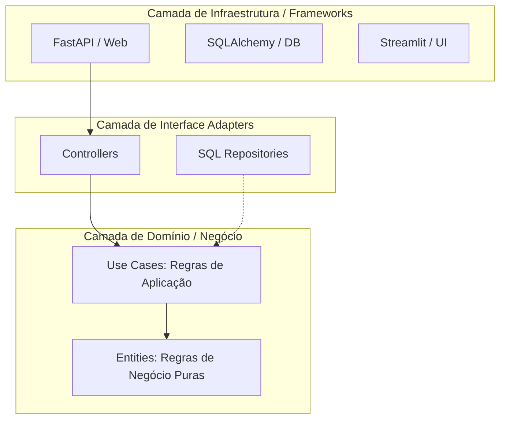

# Aula 01: O Coração da Clean Architecture e DTOs (Versão Expandida)

## 1. O Conceito: A Cebola e a Regra de Dependência

A **Clean Architecture** (Arquitetura Limpa) não é sobre pastas, é sobre **direção de dependência**.

### 1.1 Diagrama de Camadas e Fluxo

> **A Regra de Ouro:** O código das camadas internas **nunca** importa nada das camadas externas. Por exemplo: um arquivo dentro de `entities/` nunca pode dar um `import fastapi` ou `import sqlalchemy`.

---

## 2. Detalhamento das Camadas

### 2.1 Entities (O Cofre)
Representam as regras de negócio globais. Elas existiriam mesmo que não houvesse um sistema de computador.
*   **Exemplo:** Um "Usuário" no seu sistema financeiro. Ele deve ter um e-mail válido e uma senha forte. Isso é uma regra de negócio pura.
*   **Conteúdo:** Classes Python simples (`dataclasses` ou modelos Pydantic puros) com métodos que validam seus próprios dados.

### 2.2 Use Cases (O Gerente)
Contêm as regras de negócio específicas da sua aplicação. Eles orquestram o fluxo de dados.
*   **Exemplo:** `RegisterTransaction`. O Caso de Uso recebe os dados, verifica se o usuário tem saldo (usando uma Entidade), pede para o Repositório salvar e envia um e-mail de confirmação.
*   **O Segredo:** O Caso de Uso **define** como ele quer receber os dados (via DTO) e como ele quer salvar os dados (via Interface/Porta), mas ele não sabe *como* o banco de dados faz isso.

### 2.3 Interface Adapters (Os Tradutores)
Convertem os dados do formato mais conveniente para as entidades/casos de uso para o formato mais conveniente para o banco ou web.
*   **Repositories:** Traduzem objetos Python para comandos SQL.
*   **Controllers:** Traduzem requisições HTTP para chamadas de Casos de Uso.

---

## 3. DTOs vs Entidades: A Fronteira

**DTO (Data Transfer Object):** É apenas uma estrutura de dados (sem lógica) usada para cruzar as fronteiras das camadas.
*   **Input DTO:** O que vem da API para o Use Case.
*   **Output DTO:** O que o Use Case devolve para a API.

**Por que não usar a Entidade na API?**
Se você adicionar um campo `created_at` no banco de dados e ele for para a sua Entidade, e você devolver a Entidade direto na API, o seu Frontend "quebra" se você mudar o nome desse campo no banco. Com o DTO, você isola essa mudança.

---

## 4. O Princípio da Inversão de Dependência (DIP)

Este é o ponto mais importante. Como o **Use Case** (interno) chama o **Repository** (externo) sem dar `import` nele?

**Resposta:** Através de uma **Interface** (em Python, usamos `abc.ABC`).

1.  O **Use Case** define uma Interface: *"Eu preciso de alguém que saiba salvar um Usuário"*.
2.  O **Repository** implementa essa Interface: *"Eu sou o SQLRepository e eu sei fazer o que o Use Case pediu"*.
3.  Na hora de rodar o sistema, nós "injetamos" o Repository dentro do Use Case.

---

## 5. Referências para Estudo

### 📚 Livros Fundamentais
1.  **Clean Architecture (Robert C. Martin - "Uncle Bob"):** A bíblia do assunto. Explica os princípios SOLID e como eles levam à arquitetura limpa.
2.  **Architecture Patterns with Python (Harry Percival & Bob Gregory):** Conhecido como **"Cosmic Python"**. É a melhor referência para aplicar esses conceitos especificamente em Python. [Disponível online gratuitamente aqui](https://www.cosmicpython.com/book/preface.html).

### 🔗 Artigos e Blogs
1.  **The Clean Architecture (Blog Original do Uncle Bob):** [blog.cleancoder.com](https://blog.cleancoder.com/uncle-bob/2012/08/13/the-clean-architecture.html)
2.  **Martin Fowler - Patterns of Enterprise Application Architecture:** Referência clássica sobre Repositórios e DTOs. [martinfowler.com](https://martinfowler.com/eaaCatalog/dataTransferObject.html)

### 📺 Vídeos Sugeridos
1.  **"Clean Architecture in Python" (PyCon):** Procure por palestras de Sebastian Buczyński sobre o tema.
2.  **Otávio Lemos (YouTube):** Canal excelente em português que foca muito em Clean Arch e TDD.

---
*Aula atualizada em: 04 de Março de 2026*
