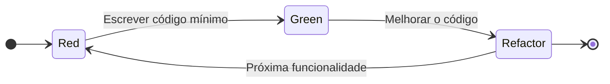

# Aula 02: TDD (Test-Driven Development) - Red, Green, Refactor

## 1. O que é TDD?

Diferente do que muitos pensam, o **TDD** não é sobre "testar o código". Ele é uma técnica de **Design de Software**. Ao escrever o teste antes do código, você se obriga a pensar na **Interface** (como o código será usado) antes da **Implementação** (como o código funciona por dentro).

> **Atenção:** TDD é um **processo**, não uma **arquitetura**. Você usa TDD para construir uma Clean Architecture.

---

## 2. O Ciclo Sagrado: Red-Green-Refactor

### 🔴 Passo 1: Red (Vermelho)
Você escreve um teste para uma pequena funcionalidade que ainda não existe.
*   **Resultado:** O teste **deve falhar**. Se ele passar, algo está errado (você testou algo que já existia ou o teste é inválido).

### 🟢 Passo 2: Green (Verde)
Você escreve o **mínimo absoluto** de código para fazer o teste passar.
*   **Mentalidade:** Não tente fazer o código perfeito agora. O objetivo é ver a luz verde o mais rápido possível.

### 🔵 Passo 3: Refactor (Refatorar)
Agora que o teste passou e você tem uma "rede de segurança", você limpa o código.
*   Melhore os nomes das variáveis.
*   Remova duplicações.
*   Aplique princípios SOLID.
*   **Importante:** O teste deve continuar verde após cada pequena mudança.

---

## 3. Os Três Níveis de Teste (Pirâmide de Testes)

No seu projeto, aplicaremos o TDD nestes níveis:

1.  **Testes Unitários (Base):** Testam as **Entities** e lógica isolada. São extremamente rápidos.
2.  **Testes de Integração (Meio):** Testam o **Use Case** conversando com o **Repository** (ou banco em memória).
3.  **Testes E2E/API (Topo):** Testam as rotas do **FastAPI** do início ao fim.

---

## 4. Por que fazer TDD na Clean Architecture?

1.  **Coragem para Refatorar:** Você pode mudar toda a implementação do Banco de Dados (externo) e, se os testes dos Casos de Uso (internos) continuarem verdes, você sabe que o sistema ainda funciona.
2.  **Documentação Viva:** Os testes dizem exatamente o que o sistema faz. Quer saber como um `User` deve se comportar? Leia o `test_user.py`.
3.  **Evita Over-engineering:** Como você só escreve código para fazer um teste passar, você evita criar funções "que talvez eu use no futuro".

---
*Aula criada em: 04 de Março de 2026*
